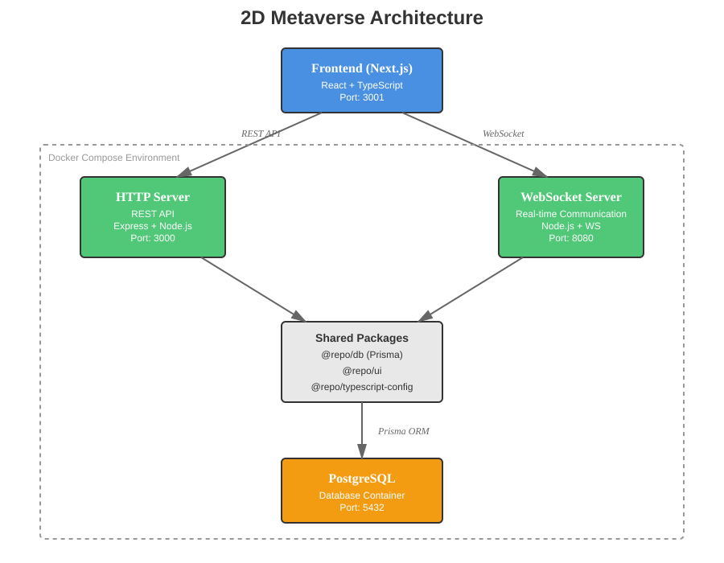

# 🌐 2D Metaverse Platform

A real-time multiplayer 2D metaverse platform built with modern web technologies. Users can create avatars, interact in virtual spaces, and communicate in real-time.

## 🏗️ Architecture



The platform follows a microservices architecture with three main components:

- **Frontend (Next.js)**: User interface and client-side logic
- **HTTP Server**: RESTful API for authentication, user management, and data operations
- **WebSocket Server**: Real-time communication for multiplayer interactions
- **PostgreSQL Database**: Persistent data storage
- **Shared Packages**: Common code and utilities shared across services

## 📦 What's Inside?

This Turborepo monorepo includes the following packages and apps:

### Applications

- **`apps/frontend`**: Next.js application for the user interface (Port: 3001)
- **`apps/http`**: Express.js REST API server (Port: 3000)
- **`apps/ws`**: WebSocket server for real-time communication (Port: 8080)

### Shared Packages

- **`@repo/db`**: Prisma database client and schemas
- **`@repo/ui`**: Shared React component library
- **`@repo/eslint-config`**: ESLint configurations
- **`@repo/typescript-config`**: TypeScript configurations
- **`@repo/prettier-config`**: Prettier configurations

All packages and apps are written in [TypeScript](https://www.typescriptlang.org/).

## 🚀 Quick Start

### Prerequisites

- **Node.js** >= 18
- **Docker** and **Docker Compose**
- **npm** 11.2.0 or higher

### Setup Instructions

1. **Clone the repository**
   ```bash
   git clone <repository-url>
   cd metaverse
   ```

2. **Copy environment variables**
   ```bash
   cp .env.example .env
   ```
   
   Edit `.env` and configure your environment variables:
   - Database credentials
   - JWT secrets
   - ImageKit keys (for avatar uploads)
   - Port configurations

3. **Run the setup script**
   ```bash
   ./setup-local.sh
   ```
   
   This script will:
   - Fix permissions for node_modules
   - Install all dependencies
   - Start Docker containers
   - Run database migrations
   - Seed initial data

4. **Access the application**
   - Frontend: http://localhost:3001
   - HTTP API: http://localhost:3000
   - WebSocket: ws://localhost:8080

## 🛠️ Development

### Start all services
```bash
npm run dev
```

### Start individual services
```bash
npm run start:frontend   # Start Next.js frontend
npm run start:http      # Start HTTP API server
npm run start:ws        # Start WebSocket server
```

### Database Operations

```bash
npm run db:generate    # Generate Prisma client
npm run db:migrate     # Run database migrations
npm run db:seed        # Seed database with initial data
```

### Build

Build all apps and packages:
```bash
npm run build
```

Build specific services:
```bash
npm run build-http    # Build HTTP server
npm run build-ws      # Build WebSocket server
```

## 🐳 Docker

The project uses Docker Compose to orchestrate services:

```bash
docker compose up      # Start all services
docker compose down    # Stop all services
docker compose logs -f # View logs
```

### Services

- **postgres**: PostgreSQL database with health checks
- **http**: HTTP API server with auto-restart
- **ws**: WebSocket server with hot-reload

## 📝 Environment Variables

Key environment variables (see `.env.example` for full list):

| Variable | Description | Default |
|----------|-------------|---------|
| `POSTGRES_DB` | Database name | mydb |
| `POSTGRES_USER` | Database user | postgres |
| `POSTGRES_PASSWORD` | Database password | mysecretpassword |
| `JWT_SECRET_ADMIN` | Admin JWT secret | - |
| `JWT_SECRET_USER` | User JWT secret | - |
| `PORT` | HTTP server port | 3000 |
| `WS_PORT` | WebSocket server port | 8080 |
| `IMAGEKIT_PUBLIC_KEY` | ImageKit public key | - |
| `IMAGEKIT_PRIVATE_KEY` | ImageKit private key | - |

## 🧪 Code Quality

### Linting
```bash
npm run lint
```

### Formatting
```bash
npm run format
```

## 📚 Tech Stack

- **Frontend**: Next.js, React, TypeScript
- **Backend**: Node.js, Express.js
- **Real-time**: WebSocket (ws library)
- **Database**: PostgreSQL, Prisma ORM
- **Monorepo**: Turborepo
- **Containerization**: Docker, Docker Compose
- **Code Quality**: ESLint, Prettier, TypeScript

## 🤝 Contributing

1. Fork the repository
2. Create a feature branch (`git checkout -b feature/amazing-feature`)
3. Commit your changes (`git commit -m 'Add amazing feature'`)
4. Push to the branch (`git push origin feature/amazing-feature`)
5. Open a Pull Request

## 📄 License

This project is licensed under the MIT License.

## 🔗 Useful Links

Learn more about the technologies used:

- [Turborepo Documentation](https://turborepo.com/docs)
- [Next.js Documentation](https://nextjs.org/docs)
- [Prisma Documentation](https://www.prisma.io/docs)
- [Docker Documentation](https://docs.docker.com)
